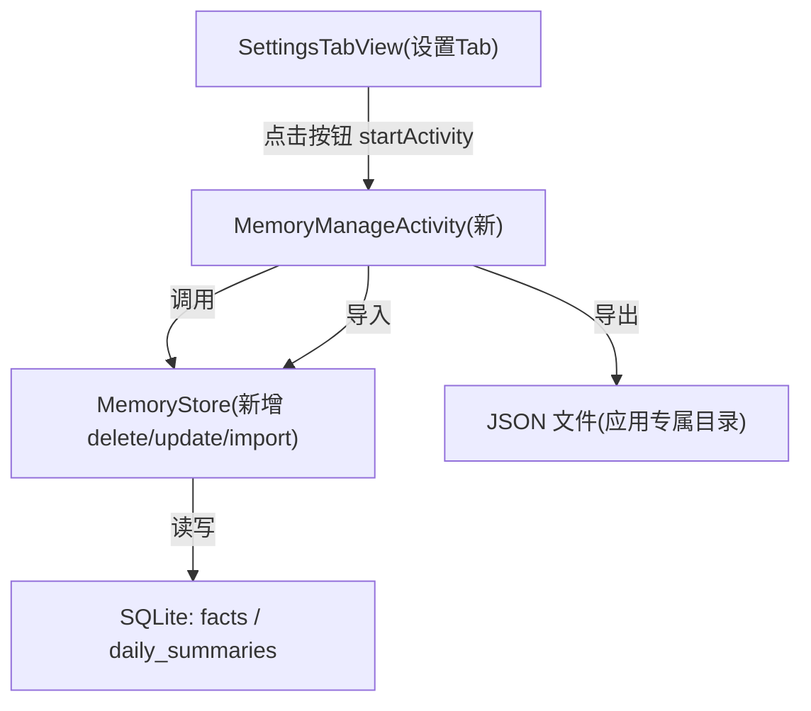

# 记忆可管理（Memory Management）

Feature Name: memory-management
Updated: 2026-08-29

## Description

在设置页新增「记忆管理」子页面，让用户查看、删除、编辑桌宠记住的长期记忆（facts 分类：profile/event/preference/self_check；daily_summaries 每日摘要），并支持将记忆导出为 JSON 备份与从备份导入恢复。目标是让用户对「数字生命」的记忆拥有可控性与可迁移性。

## Architecture



入口遵循现有模式：SettingsTabView 通过 `UiKit.card` + `UiKit.button` 增加「记忆管理」卡片，按钮 `setOnClickListener` 中 `activity.startActivity(new Intent(activity, MemoryManageActivity.class))`，与 Line 146-153 打开 CareModelsActivity 的方式一致。

## Components and Interfaces

### 1. 新增 Activity: MemoryManageActivity

- 包路径：`com.digitallife.ui.MemoryManageActivity`
- 纯代码构建 UI（与项目无 XML 布局风格一致，参考 CareModelsActivity）
- 页面结构：
  - 顶部分段切换：「事实/画像/事件」与「每日摘要」两类
  - 列表区：动态 LinearLayout 渲染每条记忆，显示文本、分类标签（facts 类）、时间戳，右侧提供「编辑」「删除」按钮
  - 底部操作区：「导出备份」「导入备份」两个按钮
- 空状态：对应分类无数据时展示提示文本

### 2. MemoryStore 需新增的方法

当前仅有写入（addXxx/saveFact）与读取（getRecentFacts/getRecentSummaries 等），缺单条更新/删除与带 id 的读取。需补充：

- `public synchronized List<Fact> getFactsByCategory(String category)`：返回含 `id` 的 Fact 列表（复用现有 Fact 类，Line 79）
- `public synchronized void deleteFact(long id)`：执行 `DELETE FROM facts WHERE id=?`
- `public synchronized void updateFact(long id, String newContent)`：执行 `UPDATE facts SET content=?, last_confirmed=? WHERE id=?`
- `public synchronized void deleteSummary(long id)`：`DELETE FROM daily_summaries WHERE id=?`
- `public synchronized void updateSummary(long id, String summary, String moodSummary)`：`UPDATE daily_summaries ... WHERE id=?`
- `public synchronized String exportJson()`：在现有 `toJson()`（Line 320）基础上扩展，输出结构携带 `id`/`category`/`timestamp`/`confidence`，覆盖 facts 与 daily_summaries
- `public synchronized void importJson(String json)`：重写已废弃的 `fromJson`（Line 345），解析备份 JSON 并逐条 `INSERT OR REPLACE`（按 id 覆盖），导入失败时抛异常由调用方捕获

### 3. SettingsTabView 改动

在「桌宠形象」卡片（Line 132）之后新增卡片：

```java
LinearLayout cMemory = UiKit.card(activity, root, "记忆管理");
Button btnMemory = UiKit.button(activity, cMemory, "打开记忆管理（查看/修正/备份）");
btnMemory.setOnClickListener(v -> {
    try {
        activity.startActivity(new Intent(activity, MemoryManageActivity.class));
    } catch (Exception e) {
        Toast.makeText(activity, "无法打开记忆管理: " + UiKit.safeMsg(e), Toast.LENGTH_SHORT).show();
    }
});
```

## Data Models

### 导出 JSON 结构（exportJson 输出）

```json
{
  "version": 1,
  "facts": [
    { "id": 12, "category": "profile", "content": "用户喜欢喝咖啡", "confidence": 1.0, "lastConfirmed": 1700000000000 }
  ],
  "dailySummaries": [
    { "id": 3, "date": "2026-08-29", "summary": "...", "moodSummary": "稳定", "createdAt": 1700000000000 }
  ]
}
```

### 导入合并规则

- 按 `id` 匹配：`INSERT OR REPLACE` 覆盖同 id 条目
- 新 id：直接插入
- 解析异常：整体回滚，不写入任何条目

## Correctness Properties

- 删除/编辑 facts 后，`AICore` 下一次构建 system prompt 时读取的记忆集合不含被删条目、含被改内容
- `CONTEXT_LIMIT` 与各类 `trim` 上限（现有 trimFacts/trimRawMessages）逻辑不受新增方法影响
- 导入操作满足原子性：任一记录解析失败则整次导入不生效
- 所有 MemoryStore 公开方法保持 `synchronized`，与现有并发访问约定一致

## Error Handling

- 删除/编辑时数据库异常：捕获后 Toast 提示「操作失败：<原因>」，列表保持原状
- 导出时存储不可写：Toast 提示失败原因，不生成残缺文件
- 导入时文件格式无效或 JSON 解析失败：Toast 提示「备份文件无效」，现有记忆不变
- 编辑保存空内容：禁用保存或提示「内容不能为空」（对应需求 R4-AC3）

## Test Strategy

- **单元测试（MemoryStore）**：
  - deleteFact/updateFact 后 getFactsByCategory 返回正确结果
  - exportJson → importJson 往返一致（round-trip）
  - importJson 遇非法 JSON 抛异常且不改变现有表
- **UI 手工验证**：
  - 设置页出现「记忆管理」入口并能打开新页
  - 删除一条 profile 后，回到对话验证 AI 不再引用该记忆
  - 导出文件能被再次导入并还原
- **回归**：确认现有对话、护理大脑记忆读写未被破坏

## References

[^1]: (MemoryStore.java) - 现有记忆读写与 toJson/fromJson 实现（Line 308-347）
[^2]: (SettingsTabView.java#132) - 形象管理卡片与启动 Activity 示例（Line 146-153）
[^3]: (UiKit.java#54) - card/button 等 UI 构件（Line 54/91/107）
[^4]: (MemoryStore.java#494) - 三张表 schema 与 id 主键定义
